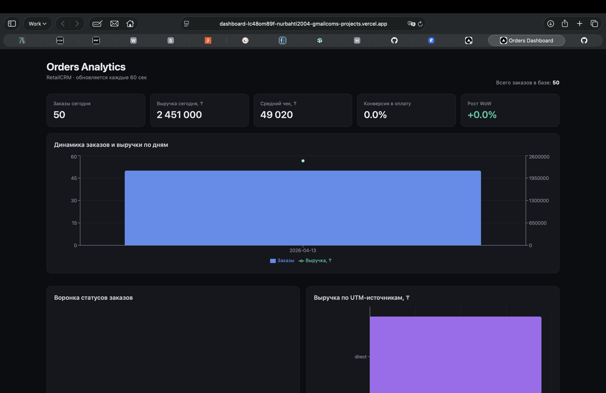
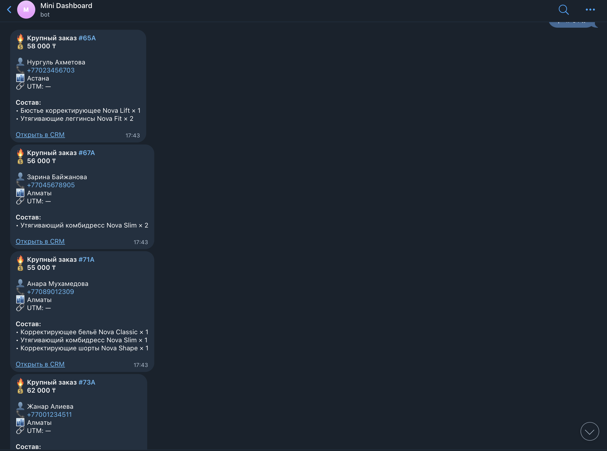
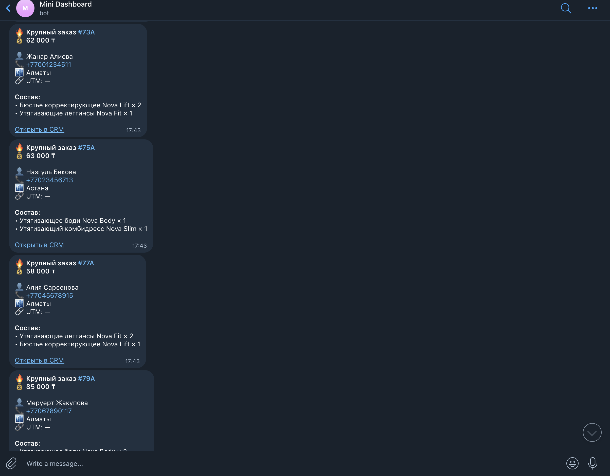

# Mini Dashboard — RetailCRM Analytics

Мини-аналитический стек для интернет-магазина: загрузка заказов из RetailCRM в Supabase, публичный BI-дашборд на Next.js + Vercel и Telegram-уведомления о крупных заказах.

🔗 **Live demo:** [dashboard-xxx.vercel.app](https://dashboard-lc48om89f-nurbahti2004-gmailcoms-projects.vercel.app)

---

## 📸 Скриншоты

> Замените файлы в `docs/` на свои скриншоты — ссылки подхватятся автоматически.

### Дашборд


### Telegram-уведомление



---

## 🧩 Что внутри

| Компонент | Назначение | Стек |
|---|---|---|
| `load_orders.py` | Загрузка тестовых заказов в RetailCRM | Python + requests |
| `load_orders_to_supabase.py` | Синхронизация заказов RetailCRM → Supabase | Python + supabase-py |
| `dashboard/` | Публичный BI-дашборд | Next.js 14, TypeScript, Recharts |
| `telegram_notifier.py` | Уведомления о заказах от 50 000 ₸ | Python + cron |

---

## 🏗 Архитектура

```
┌──────────────┐   upload    ┌──────────────┐   sync   ┌──────────────┐
│ mock_orders  │────────────▶│  RetailCRM   │─────────▶│   Supabase   │
│   .json      │             │   API v5     │          │  (Postgres)  │
└──────────────┘             └──────────────┘          └──────┬───────┘
                                    │                         │
                                    │ poll                    │ read (anon)
                                    ▼                         ▼
                             ┌──────────────┐          ┌──────────────┐
                             │  Telegram    │          │   Next.js    │
                             │     bot      │          │ Dashboard    │
                             └──────────────┘          │  on Vercel   │
                                                       └──────────────┘
```

---

## 🚀 Быстрый старт

### 1. Клонировать и поставить зависимости

```bash
git clone https://github.com/ВАШ_ЛОГИН/mini-dashboard.git
cd mini-dashboard

# Python
python3 -m venv tz_venv
source tz_venv/bin/activate
pip install requests supabase

# Next.js-дашборд
cd dashboard && npm install && cd ..
```

### 2. Настроить `.env`

Создайте `.env` в корне (этот файл в `.gitignore`, секреты не уедут в git):

```env
CRM_URL=https://ваш-адрес.retailcrm.ru
CRM_KEY=ваш_retailcrm_key

SB_URL=https://xxxxx.supabase.co
SB_KEY=ваш_supabase_service_role_key

TG_TOKEN=123456:AA...
TG_CHAT=123456789
```

Для дашборда отдельно — `dashboard/.env.local`:

```env
NEXT_PUBLIC_SUPABASE_URL=https://xxxxx.supabase.co
NEXT_PUBLIC_SUPABASE_ANON_KEY=ваш_anon_key
```

### 3. Подготовить Supabase

В SQL Editor выполнить один раз:

```sql
-- таблицы
create table if not exists orders (
    id bigint primary key, number text, external_id text,
    status text, order_type text, order_method text,
    created_at timestamptz,
    first_name text, last_name text, phone text, email text,
    total_summ numeric(12,2),
    city text, address text, utm_source text,
    raw jsonb not null, synced_at timestamptz default now()
);
create table if not exists order_items (
    id bigint primary key,
    order_id bigint not null references orders(id) on delete cascade,
    product_name text, quantity numeric(12,3),
    initial_price numeric(12,2), discount_total numeric(12,2),
    raw jsonb not null
);

-- публичный read-only доступ для дашборда
alter table orders      enable row level security;
alter table order_items enable row level security;

create policy "public read orders"
  on orders for select to anon using (true);
create policy "public read order_items"
  on order_items for select to anon using (true);
```

---

## 📦 Использование

### Загрузить тестовые заказы в RetailCRM

```bash
python3 load_orders.py
```

### Синхронизировать заказы в Supabase

```bash
python3 load_orders_to_supabase.py
```

Использует `upsert` — повторный запуск безопасен, дубликатов не будет.

### Запустить дашборд локально

```bash
cd dashboard
npm run dev
# → http://localhost:3000
```

### Деплой дашборда на Vercel

```bash
cd dashboard
vercel --prod
```

Не забыть добавить `NEXT_PUBLIC_SUPABASE_URL` и `NEXT_PUBLIC_SUPABASE_ANON_KEY` в **Project Settings → Environment Variables**.

### Telegram-уведомления по cron (macOS/Linux)

Первый запуск — «обучающий», чтобы скрипт запомнил текущий максимальный ID заказа:

```bash
python3 -c "
import requests, os
r = requests.get(f'{os.environ[\"CRM_URL\"]}/api/v5/orders',
    headers={'X-API-KEY': os.environ['CRM_KEY']}, params={'limit':1})
print(r.json()['orders'][0]['id'])
" > last_seen.txt
```

Добавить в crontab (`crontab -e`):

```cron
*/3 * * * * cd /путь/к/проекту && /usr/bin/python3 telegram_notifier.py >> notifier.log 2>&1
```

Проверка логов:

```bash
tail -f notifier.log
```

---

## 📊 Метрики дашборда

- **KPI**: заказы сегодня, выручка сегодня, средний чек, конверсия в оплату, рост WoW
- **Динамика по дням** — заказы (столбики) + выручка (линия) на двух осях
- **Воронка статусов** — new → approval → assembling → delivering → complete
- **Выручка по UTM-источникам**
- **Heatmap день недели × час** — когда пик заказов
- **Топ-10 городов**
- **Топ товаров по выручке**

---

## 🛠 Стек

- **Backend / Data:** Python 3, RetailCRM API v5, Supabase (Postgres)
- **Frontend:** Next.js 14 (App Router), TypeScript, Recharts
- **Deploy:** Vercel
- **Notifications:** Telegram Bot API + cron

---

Общие выводы

Промпт с уточнениями экономит время. Когда Claude задавал 2-3 уточняющих вопроса с вариантами (polling или webhook? локально или в облаке?) — на выходе сразу был подходящий код. Без уточнений он бы угадывал и переделывал.
90% ошибок — в окружении, не в коде. Неправильный URL Supabase, пустые переменные окружения, не тот ключ, не включённая RLS-политика. Сам код работал с первой попытки в трёх из четырёх случаев.
Сообщения об ошибках — половина решения. Кидал Claude-у трейсбек целиком, даже HTML на 3000 строк — он сразу видел, что это страница-заглушка Supabase Studio, и указывал причину.
Справочники в CRM всегда проверять отдельно. Чужие коды типов/статусов/методов оформления — вероятно, не совпадут с вашими.
anon и service_role — разные ключи для разных задач. Бэкенд-скрипт → service_role. Публичный фронтенд → anon + RLS-политики на чтение.

## 📝 Лицензия

MIT
